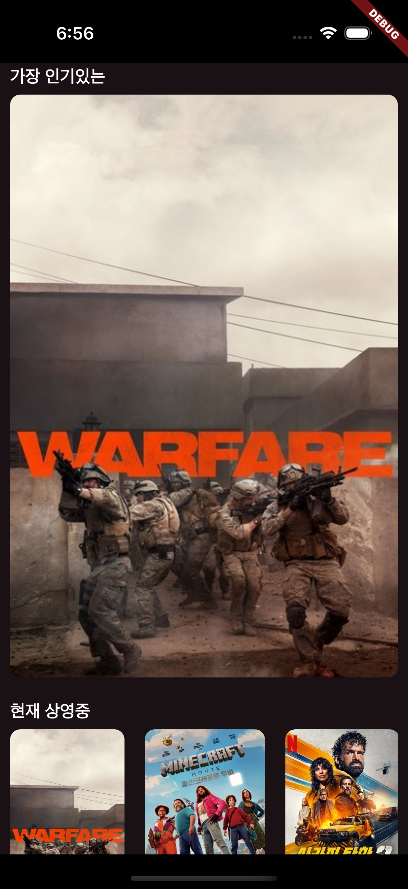
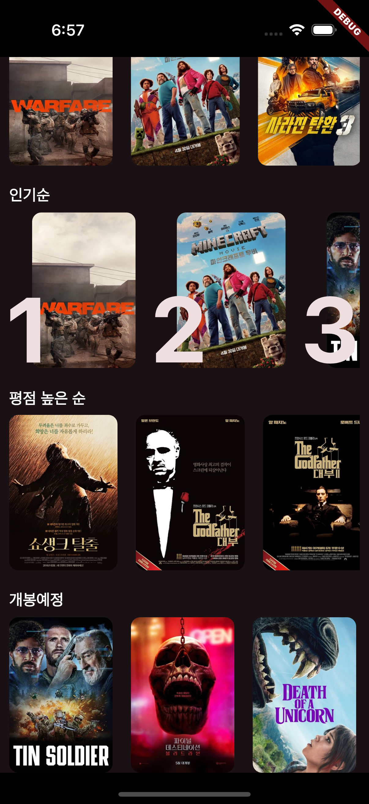
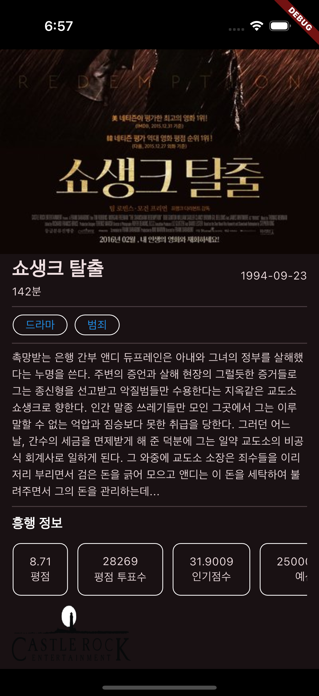

# 영화 정보 앱

## 📌 프로젝트 소개

tmdb api를 활용하여 영화 정보를 가져오고 Hero 위젯을 활용하여 라우트시에 애니메이션 효과를 넣었다.

## 📱 스크린샷

  
    
    
    
    

## 🎯 주요 기능

- **영화 목록 표시**: 영화를 각각 다른 기준으로 여러개의 목록을 표시한다.
- **영화 상세 정보**: 포스터 이미지 클릭 시 상세정보를 보여준다.

## ✨ 추가 기능

### 1. 상태 관리

- **riverpod**: riverpod을 이용한 상태관리
- **clean architecture**: model, viewmodel, usecase, repository, datasource를 활용하여 계층을 관리

### 2. 향상된 UI/UX

- **Hero위젯**: 포스트 이미지 클릭 시 이미지가 확대되는 에니메이션을 제공

## 📦 의존성 패키지

프로젝트에서 사용된 주요 패키지:

- **dio**: http통신을 위한 리이브러리
- **flutter_dotenv**: 보안이 필요한 키값을 감추기 위한 라이브러리
- **flutter_riverpod**: 상태관리 라이브러리

## 👥 팀원

| 이름                           | GitHub                                      |
| ---------------------------- | ------------------------------------------- |
| 김기현                          | [arcmee](https://github.com/arcmee)         |

## 📄 라이센스

이 프로젝트는 MIT 라이센스 하에 제공됩니다. 자세한 내용은 [LICENSE](LICENSE) 파일을 참조하세요.